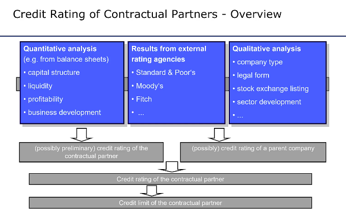
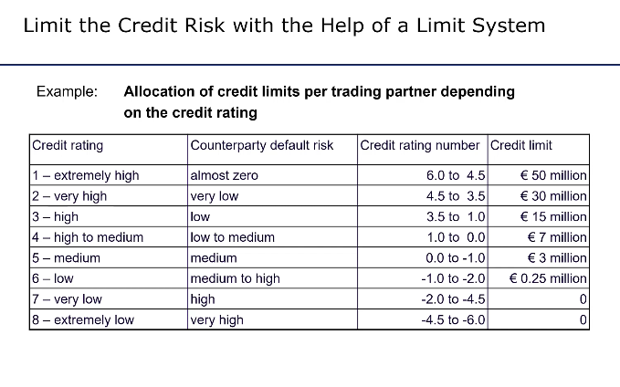
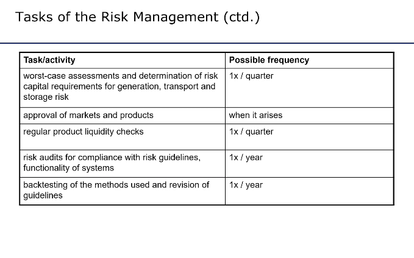

# Risk Management

## Contents:
1. [Types of Risk](#types-of-risk)
2. [Credit Risk Management](#credit-risk-management)
3. [Price Risk Management](#price-risk-management)
4. [Risk Management Processes](#risk-management-processes)

---
> (EM14)[https://youtu.be/4QURUuL4ch4?si=jixWYkCMCrRZnCjA]

# Types of Risk
+ Extent of damage **vs** Probability of ocurring
+ Price risk, Credit/Counterparty risk (default), Volume risk (volumes are different than expected), liquidity shortage risk, product liquidity risk, legal risk, system risk, administrative risk (staff doing something wrong), storage and transport failure risk

1. **Price risk**: price changes affect the open position; influenced by size of position (leverage comes with risk); factors are volatility (ex daily) and max epected/occured price change
2. **Volume risk**: deviation between expected and realised supply and/or demand volumes (ex plant outage); influenced by generation outages, change of consumer base and behaviour; forecasted vs actual demand + generation (consumption profile, stochastic photovoltaic or wind feed-in)
3. **Liquidity Shortage/Cash Flow risk**: poorly coordinated payment flows/deadlines cause insufficient liquid funds. Influenced by contract design, exchange/partners requirements for cash collateral, contractual composition of portfolios
4. **Product Liquidity Risk**: insufficient trading volume of products (positions cannot be opened/closed efficiently). Influenced by composition of portfolio and open positions (focus on most liquid time periods/products); general market conditions.
5. **Legal risk**: poorly formulated contracts lead to unforseeable/nonfulfillabel obligations/claims from third parties. Influenced by contract design; legislative changes; interpretation of the courts.
6. **System Risk**: malfunction of processes, systems or procedures. Organisation; Software; Hardware (can mess up balancing or general operations, in generation assets, wholesale trading etc.).
7. **Administrative Risk**: errors/omissions of acting people. Influenced by employees (training...), organisation, documentation and communication, control. (human error or non compliance with processes and rules)
8. **Credit Risk**: Counter party default. Influenced by credit rating of counterparties, financial volumes per counterparty, **netting agreement** (only owe the difference between long and short positions with the company; if they go bankrupt you don't pay when they can't pay you), forward vs futures (futures mark to market every day on a margin account so have strong control against counterparty; they are also contracts with exchange), margin calls/collateral.

---

# Credit Risk Management
> (EM15)[https://youtu.be/uJGwAGEobaY?si=WiAx_z0MdZSoL8V1]

**Components**
risk arises as soon as contracts for energy supply/consumption are concluded. Risk is sum of the following:
+ **Resale (or Rebuy) Risk**: difference between market price and contracted price of undelivered energy
+ **Free delivery exposure**: value of delivered but unpaid energy quantities (contract is fulfulled even if counterparty is bankrupt: note for month contracts, usually paid on the 20th of the next month)

+ ex. for a six month contract

**Factors**
+ contract volume/quantity
+ time duration between conclusion (signed) of contract and start of delivery period
+ price increase after a purchase or price decrease after a sale.
+ increases with number of opposing positions without netting agreements
+ lower creditworthiness of counterparty (differentiate how large you allow the contract to be depending on credit rating): determing **credit rating and limit**

---

# Price Risk Management

> (EM16)[https://youtu.be/VvBAxkfjlfI?si=fDLv-J6nGbHmcE8a]

## Current Portfolio Value
+ Current market position of the utility (sell and buy quantities and prices)
+ Current valuation of open position at market prices (mark to market): poterntial income from sale of long positions minus costs for closing short positions
+ Value of open position = $v = \Sigma_t OP_t p_t$ sum of open positions for all time periods multiplied by electricity price: price for each time can change meaning portfolio value is variable / price is not known for a period (might be too far into the future).
+ calculate an **hourly price forward curve (HPFC)**
+ an hourly/quarter hourly electricity consumption or delivery profle is called a **schedule** => use current market prices for the delivery period's futures contracts (also OTC info) for base load and peak prices then we add the structure from historical data for hourly prices/quarterhourly (in proportion of base price) => current estimate for **HPFC** to then value any open position.

## Risk Indicators
+ You do not wait to exceed risk capital as it takes time to calculate how much of it is being used, to communicate that information within the company and for traders to close the open positions => use an appropriate amount of risk capital and try and predict future risk capital use (how risky some open positions are).
+ **Stress** indicates change in value of portfolio from today to tomorrow, expected in the worst case: this must not exceed the remaining risk capital. Calculate using maximum price change between days from historical prices.
+ **Value at risk** is the maximum possible loss a portfolio can suffer under normal market conditions with a given confidence level and a specified period. Use Historial simulation (analyse time series of price changes for past period; apply historical price changes to the current price and evaluate resulting portfolio for future period of same length; discard 1% most unfavourable value changes, the next most unfavourable value is the value at risk), analytical methods and Monte Carlo simulation.
+ Advantages to historical simulation: relatively accurate and easy to implement; disadvantages = long history required, assumes same price behaviour in the future, blind to abnormal market behaviour.
+ Analytical: fit a normal distribution to approximate returns (cahnge of prices' logarithm): $$ri = ln(P_i) - ln(P_{i-1}). Linear approximation of the change in portfolio value $$\delta W = V \delta P$$
+ **Profit at Risk (PaR)**: potential profit or loss under illiquid market conditions (assumes all positions must be closed on the spot or balancing reserve market): spot price scenarios (calculate profit for each scenario, exclude 5% most unfavourable, PaR is the difference between down-side profic and expected profit); *Can also include* **volume risk** (deviation between long and short-term forecast (volume risk spot), deviation between short-term and measured values (volume risk balancing energy)).
---

# Risk Management Processes

> (EM17)[https://youtu.be/B5SME-_Vlvs?si=4DjJsrfxiuIWI6UA]

## Initialisation
+ **Organisation** chart, procurement/sales/controlling/billing/finance, right and obligations of people involved in the context of procurement and sales; determination and allocation of risk capital
+ **Processes** what is already in place; rights and obligations
+ **Systems** procurement, sales, forecasts
+ **Procurement situation** what kind of contracts are used, baseload, flexible, open contracts, storage capacities
+ **Sales situation** household customers, large or risky counterparties, sales territory (own grid or external), historic load profiles, separate portfolios

+ **Risk Capital** risk taken should not threatened continued existence of the company; risk capital must suffice for even the worst case; total risk must then be sub-divided among various business areas /activities based on strategic importance or expected return on risk capital. => Credit risk capital (credit limit per credit rating), Price risk capital (loss limit electricity and gas trading and sales) and other.
+ **Allocation of Responsibilities** who is allowed to do what, what products/markets are appropriate (specified in **risk manual**)
+ **Risk Reporting**: done on a daily basis, for ex to show probability distribution of loss for a portfolio, to serve as a basis for decisions.
+ **Risk committe** instrument of risk management to ensure implementation of procurement strategy and risk policy in generation, portfolio management and sales (including financial and corporate planning). 

