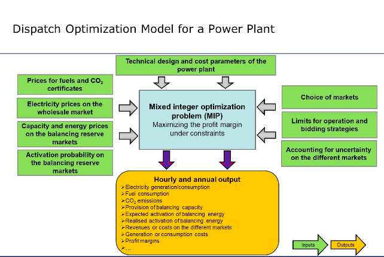

# Introduction

> (EM1)[https://youtu.be/SiMLey6XLTI?si=AXLFxilVPH8idH_H]

## Contents:
1. [Overview (Generation, Utility, Wholesale Market, Retail Market)](#overview-generation-utility-wholesale-market-retail-market)
2. [Characteristics of Energy Commodities, Merit Order, Price Formation](#characteristics-of-energy-commodities-merit-order-price-formation)

---

# Overview (Generation, Utility, Wholesale Market, Retail Market)
**Map**
Generation Assets (Power Plant, Wind Farm, Gas Field) -> 

Portfolio Management (Operative Function, can be same or different unit/company): sells energy and chooses how to operate generation

Portfolio <-> Wholesale Market (Portfolio Management sells or buys energy commodities)

Portfolio -> Retail Market (business, industry customers, final customers)

---
If all of the above is done: Integrated Portfolio.

**Portfolio <-> Wholesale Market = Prop Trading**
- a company trades to make money by buying and selling on wholesale market (no generation or selling for consumption)

**Portfolio <-> Wholesale and -> Retail Market**
- buys on wholesale market and sells on retail market (final consumers: households, industry) (typical for retail energy companies, municipalities, in the area or outside core region, or very large energy consumers(ex. Deutsche Bahn) buying more efficiently for their own needs through their own energy portfolio management team)

**Generation -> Portfolio -> Wholesale Market**
- portfolio management of generation asset decides how to operate generation (optimal production schedule, buying emission allowances, buying fuel ...) and sells on wholesale market
- independent energy producers (windfarms, large solar projects, merchant power plants, gas producers)

**Integrated Portfolio**
- ex large municipalities (generation, wholesale, retail, management), very large industrial consumers (chemical industries, transport), tier 1 energy companies.

---
# Characteristics of Energy Commodities, Merit Order, Price Formation

## Characteristics of Electricity and Gas as Commodities and Consequences for Market
**Characteristics**
+ grid bound (energy, natural gas pipes for transport)
+ supply = demand in real time to guarantee frequency
+ storing can be costly or difficult
+ seasonality and uncertainty on supply and demand side (demand: ex. household demand falls during the night, higher during the day; usually holds for the economy as a whole; working days; winter peaking and summer peaking companies (depending on country location): heating and AC) (supply: wind and sun for renewable generation): seasonality usually straightforward to predict, uncertainty in unknown (wind is blowing or not, temperature is warm or cold)

**Consequences for market**
- size of market depends on grid usage (**interconnector constraints** define separate markets)
- product is different today and tomorrow (supply and demand determine price and value, storing, uncertainty needs to be accounted for)

---
## Merit Order

The **merit order** is a key concept in the energy sector, particularly in electricity markets. It refers to the way in which power plants are ranked and dispatched (selected to generate electricity) based on their marginal costs of production. The main idea behind the merit order is to minimize the cost of electricity generation by prioritizing cheaper sources of power.

### How Merit Order Works:
1. **Marginal Cost Ranking**: Power plants are ranked in ascending order according to their **marginal cost**—the cost of producing one additional unit of electricity. Marginal costs are primarily driven by fuel prices, operational efficiency, and emissions costs. 
   - **Renewable energy** (wind, solar) typically has very low marginal costs, since wind and sunlight are free.
   - **Nuclear power** has relatively low marginal costs, followed by **coal** and **natural gas** plants.
   - Older and less efficient fossil fuel plants tend to have higher marginal costs.

2. **Supply and Demand**: Electricity demand fluctuates throughout the day, so system operators dispatch electricity from plants in the order of the merit ranking. Power plants with the lowest marginal cost are used first, and as demand increases, more expensive plants are brought online to meet the demand.

3. **Market Clearing Price**: The price of electricity in the market is typically set by the last (most expensive) power plant needed to meet demand at a given time. This plant is referred to as the "marginal plant" and its cost determines the **market clearing price** for all electricity generated.

### Example of Merit Order:
- At low demand, power is supplied by low-cost renewable energy sources like wind and solar.
- As demand rises (e.g., during peak hours), additional capacity is needed, so more expensive natural gas or coal plants are brought online.
- The last and most expensive plant required to meet demand sets the electricity price for the entire market.

### Importance in Energy Markets:
- **Efficiency**: Merit order ensures that electricity is generated at the lowest possible cost by using the cheapest resources first.
- **Price Dynamics**: Since renewable energy has low marginal costs, their increased integration into the grid pushes expensive fossil fuel plants further up the merit order, potentially lowering overall electricity prices.
- **Impact on Profitability**: Power plants lower in the merit order (like renewables) have an advantage in being dispatched more frequently, while more expensive plants may only be dispatched during periods of high demand.
- **Environmental Benefits**: As the share of low-cost, low-carbon renewable energy grows, it can reduce reliance on fossil fuels and lead to lower greenhouse gas emissions.

In summary, the merit order helps optimize electricity generation, keeping costs down and influencing market prices while also supporting the integration of renewable energy sources.

---
## Price Formation of Energy Commodities
- supply and demand on exchange: markets intersecting supply and demand find the equilibrium price.

---
---
---
# Portfolio Management

## Contents:
1. [Prop Trading on Wholesale Markets](#prop-trading-on-wholesale-markets)
2. [Energy Utility with Retail Focus](#energy-utility-with-retail-focus)
3. [Energy utility with Generation Focus](#energy-utility-with-generation-focus)
4. [Integrated Portfolio Management](#integrated-portfolio-management)

---
# Prop Trading on Wholesale Markets

## Markets and Products

> (EM2)[https://youtu.be/FEdLHTKOyr4?si=UvRaGLm0CHYdIQqg]

### Day Ahead Markets for Electricity
In liberalised energy markets there are day-ahead auctions (in Europe hourly) on power exchanges such as EPEX spot and Nordpool:
+ on EPEX each day at noon, prices are determined for the 24h of the following day for regions and countries in mostly independent auctions. Before auctions buyers and sellers bid: price for each hour is the intersection of the aggregated supply and demand curve for that hour.
**Products**
+ physical delivery (which grid) in specified control areas (grid input)
+ smallest delivery volume 0.1MW for individual hours
+ EPEX is central counterparty for physical and financial settlement

**Bidding and Pricing Example**
+ voluntary bidding; can specify quantity and price levels; can shift from being consumer (when prices are low) to producer (high prices): aggregated demand and supply determines price. Then bids describe what market actors do (how much they produce/buy) / at this equilibrium the same amount of electricity is generated and bought.

+ we can plot resulting hourly prices to show hour price variation. The peak line (usually 8 am to pm on workdays) covers range of high prices.
+ other case: high morning and high late afternoon, with drop in between.
+ Day ahead electricity trading: huge price spikes (exchange has upper limit 3000 euro per megawatt hour), usually 10-50 euro per MWH. Also negative prices!!
+ Annual average process is mean reversing as if higher than investment costs then new generation is introduced and if lower then generation is cutback.

### Day Ahead Markets for Gas
+ easier to store than electricity: usually smaller volatility. Usually not hourly but daily products 24h. Within day trading presents strong volatility.

### Forwards and Futures
+ **Delivery period**/period of fulfullment, specifies the product (time range not time point)
+ price depends on expected supply/demand/energy price: Expected Spot price (ex. delivery for night hours or months like December (holiday) lower demand, periods of higher renewable generation higher supply)
+ ex. front year contract (delivered from start to end of next year)
+ **Trading Period** during which contracts can be written: when is contract concluded?
+ ex. front year contracts can be traded any time before delivery
+ at the end of trading period, futures price converges to spot price

+ **Liquidity**: how quickly and at what cost (bid-ask spread) can I open and close positions on the contract. Higher when more supply and demand in the product.
+ Trade off between product fit (is it what we want) and liquidity (much higher in base-load contract, market has standardised contracts that have very high liquidity: approximates structure (fit) and assures liquidity) (availibility and flexibility of position: ex if necessities change and you want to sell contract).
1. Short term (day ahead, day products, weekends, weeks)
2. Medium term (front month, months, quarters)
3. Long term (summer/winter, front year, annual products)
Highest liquidity when close to delivery period.

Long Term: How to use products to replicate a certain demand profile?
+ **base** (24h): usually a bit higher than client min demand (resell when extra)
+ **peak** hourly to mirror hourly demand
+ the rest is bought shorter term, most **price risk** on spot price has been hedged (hourly price risk is present but base and peak price risk is mostly resolved)

**Natural gas**
+ easier to store, is **compressible** (supply/injection and demand/withdrawal do not always need to match)
+ future markets only trade base product (no hourly or peak 8am-pm product)

**Alternative Forms of Trading**
1. Exchanges
+ standardized products, state supervised, anonymous (buying/selling to exchange, you don't know where energy you buy is coming from/energy you sell is going), transparent, electronic trading, exchange is the central counterparty (as long as exchange is solvent contracts are resolved: very low credit risk), fixed transaction costs
2. OTC (over the counter): Broker platforms
+ broker brings parties (supply and demand) together
+ removal on anonymity when concluding contract, semitransparent, telephone/electronic trading, **credit risk of counterparty**, transaction costs negotiable
3. OTC: Bilateral
+ bilateral negotiations (direct contact, no intermediary like a broker for quotes), individual products, non transparent, credit risk of counterparty, implicit transaction costs

#### Bid, Ask and bid-ask-Spread
+ **Bid** potential buyer of commodity places a bid, bid price (maximum accepted price) and quantity (willing to buy at that price, in MGW: standardized volume 5MGW)
+ **Ask** potential seller of commodity places and ask/offer (ask price (min price willing to accept), quantity willing to sell at that price); small prices jumps between offers shows good liquidity
+ **Bid-ASk-Spread** amount by which ask price exceeds bid price: central indicator for liquidity of asset. Trade happens when seller is willing to sell at highest bid or buyer is willing to buy at lowest ask/offer

#### Power Exchanges
+ comparable to stock exchanges, provide a lot of information
+ example: European Energy Exchange (EEX): can find quotes for the front year base load electricity contracts, natural gas and co2 emmission allowances.

#### Long Term Forward and Futures Markets
+ Generators and Utilities want to hedge risks (uncertainty in spot price), or profit from trading
+ Forwards settled physically, futures settled financially (near identical payoff profiles: same payoff and pricing as derivatives; interest rate developments are different)
+ forward payments (delivery period), futures (margin account brought to market every day)
+ futures are standardized, exchange traded; futures mostly traded OTC
+ payoff S_T - F

## Buying and Selling on Wholesale Markets

> (EM3)[https://youtu.be/PaH_Ava23lE?si=yqKWTdBstqMS1dRr]

**Prop Trading**: Principal trading for direct gain rather than commision.

## Open Position
+ difference between purchase/buy and sales/sell for a delivery period h
$$OP_h = BUY_h - SELL_h$$
+ open position can change over time in the trading period though transactions or changing expectations for derivatives
+ managing open position = portfolio management
+ the expected open position for the **trade** balancing group the day before delivery period start must be zero (so you are not selling or getting delivery: want to close out position before delivery): by law what we bought must equal what we sold for the delivery period h (must be equal hourly)
+ this is strongly regulated because the real world process underlying it is very complicated; consumption and supply must be equal and communicated to transmission grid controllers to maintain correct frequency.

### Grid Access / Physics and Schedules
+ Schedule = Energy time series
+ balancing groups ensure injection and extraction in grid are balanced
+ balancing group: several, one or none (**trade balancing group**) grid users (power plant or consumers)
+ they help TSOs maintain stable and reliable grid operation

### Energy Trading
1. Arbitrage: risk free profits from different profits on parallel market places
+ trading platforms
+ regional (transportation)
+ forward/spot
2. Speculation: take open position in expectation of certain market price development (over/under-valued)
+ take long/short position, close out with spot price at delivery
3. Optimizing Procurement and Sales: 
+ diversification of procurement and sales
+ international supply
+ access to wholesale market instruments

---
# Energy Utility with Retail Focus
Wholesale Market -> Portfolio Management -> Retail Market

## Selling to Retail Customers
> (EM4)[https://youtu.be/9YPjwCsndMc?si=DQ9jASOVlxv4tvrq]

### Types of Customers
Mostly end users of energy / final consumers:
+ **Household customer**: low energy volumes, low absolute revenue per customer (Automated processes to set up contract to keep costs low for provider), uncertain contract duration (right to terminate on short notice) (**Volume Risk** implicit risk for portfolio management: managing open position, follow up trades), rarely real-time measured (measure consumption per year -> standard load profiles, take artificial average structure), typically flat price.
+ **Large Industrial customer**: high energy volumes, high absolute revenue per customer (make individual contracts, long negotiations, marketing and sales team performance is important), clearly defined contract time, measured in real time.
+ **SME: Small Medium Enterprises**: somewhere in between depending on volume.

### Contract Types
1. **Predefined fixed-volume contracts**: delivery structure (standard product or individual load profile) fixed when contract is signed, could be purchased immediately and completely in futures markets (to close open position immediately: flat position)
2. **Open Volume**: utility delivers what customers need, procurement at future markets is based on **load forecasts**, volume and price risk (1. Price risk is borne by utility (basically selling a procurement option to the client, may or may not exercise, contract may even allow reselling), 2. Client can vary volumes and difference is indexed to spot market price (utility bears no price risk))

## Buying on Wholesale Market
> See above (Buying and Selling on Wholesale Markets)

## Procurement Strategies and Open Position
> (EM5)[https://youtu.be/zAZz_aaD6-g?si=ciI_Rnm1LeItIulr]
Wholesale market -> Portfolio Management -> Retail Market
(municipalities, industry ...).

### Intro
**How do we make make profit from Retail Activities?**
+ utility buys on wholesale and sell on retail: profit can be increased by selling at high prices, good sales team (convincing customers, creating a brand); keeping costs down with the utility (lowering overhead per unit sold); good procurement team on wholesale market (buying cheap).

**Open Position for Retail Focused Utilities**
+ difference between buy and sell/consumption for delivery period h, open position can change over time.
+ the day before the delivery period all balancing groups must be balanced (open positions = 0, buy as much as you sell/consume (utility/large consumer)).

**Procurement Strategies**
1. Low Risk: no or hardly any open position: when you get request for supply, immediately balance by buying on wholesal (Back to Back); this does not involve any price risk -> margins come from sales or low overhead costs
2. Taking on Risk: Choice of favourable procurement times (when asset is undervalued), speculative portfolios, requires risk management and risk capital, margins realized also through procurement below sales price.

### Examples
**Simulation of Portfolio Management Process**: simulate two alternative procurement strategies, use automatic purchase triggers to simplify simulation.

**Basics of Procurement Strategy**:
+ Company risk attitude (Back to back strategy or willing to take some risks)
+ Rigid Procurement Mechanisms: avoid irrational/short term decisions, price-triggered purchase orders (ex. dynamic stop loss: if prices start rising buy to hedge loss, otherwise don't buy hoping prices will go down so future purchase is cheaper; reference price is upward stable and downward dynamic: with a previously defined gap (spread): if last procurement is lower than previous reference then reference shifts down to last procurement, if next settlement is higher but not by more than the spread then our limit remains the same, if higher than both then it becomes the new reference).
+ dynamic stop loss can be used to procure standard products and schedules
+ real world strategies are more complex
+ permanent evaluation of activities and iterative improvement of procurement system.

**Example**
Household Customer Portfolio
+ expected sales 534 GWh
+ maximal demand 141 MW
+ utility is self-averse, open to integrated strategies
+ start of portfolio management y-2
+ end of management 3 months before first delivery day (additional: close at leat 85% of open quantities to have calculation basis for expected price level)

1. Four identical schedules (one for each quarter)(Q4 y-2, Q1 y-1, Q2 y-1, Q3 y-1 is when management happens): price trigger is a dynamic stop loss, reference price is EEX **base** closing price on first day of each quarter; each quarter is procured separately (-> we have different procurement price for each quarter)

2. 20MW base (16 quarterly with limit system, 4 during delivery at spot), 28 MW peak (24 quarterly trading approach, 4 delivery at spot price), remaining 270 GWh (split in two equal schedules: first procured at 'historically low prices', second is procured in third quarter to adapt to changes in customer structure)
+ base: limit system (base price dynamic stop-loss limit); peak: trading approach (buy when daily chart breaks through the 6-week moving average from bottom to top, also other reasonable triggers); 'historically low' below moving half year average and moving six week average breaks through this from below

### Chances and Risks
> (EM6)[https://youtu.be/nwFSPJvM-Eo?si=EWxuv35GhG_SXPX9]

+ price risks tied to open position and price changes: long position profit if rising prices, loss if falling prices viceversa for short position. The higher the open position the higher the leverage.
$$OP_h = BUY_h - SELL/CON_h$$
+ possible uncertainties: unknown delivery quantity for household consumers, monitoring buying and selling prices can be challenging => use reasonable estimates
+ **back to back procurement**: open position = 0 (no risk)
+ reasons to take risk: expectation of **positive contribution margins** through active management of open position; **consumer requests** flexible purchase quantities, duration of contracts, period of validity for proposals (offer price is relevant for today but might be agreed to after time taken for client to evaluate proposal); **insufficient long term liquidity** energy investment need to offload long position but might be difficult.

**Structured Procurement under Consideration of Sales**
+ compare current sales to current procurement volumes
+ portfolio tries to undercut wholesale price at the time of the **sales** deal (sales price is the one to beat)

**Influencing Parameters on Sales**
+ market expectation of utility drives direction and size of open position (long if we expect rising prices)
+ limit/event oriented procurement strategies
+ current sales indicate: procurement volume, schedule and timing

**Procurement Strategies**
1. Limit Oriented
2. Event Oriented: procurement strategy based on market conditions (ex. monthly prices) and market expectations
3. Extensions: spot market transactions, option trading, trend following ...

**Holistic Approach**
+ pros: focused on company, transparent, key metrics calculations
+ cons: high data requirements, crossing departments (procurement, sales, portfolio), profit responsibilities (internal incentives are set right)

---
---
# Energy utility with Generation Focus

## Spreads and Profitability of Power Plants
> (EM7)[https://youtu.be/dnkZjvEJmGc?si=bDot_jgUbi8Fxqek]

**Spark Spreads**
+ important non-standard product in energy markets; cross commodity products where payoff is driven by difference between costs and sales (ex gas and electricity prices $S_t \text{(electricity price)} - K_H \text{(conversion factor)} G_t \text{(gas price)}$, reciprocal of conversion factor is efficiency)

**Clean Spread**
+ takes **CO2** into account
+ value is $S_t - K_H (G_t + E_{CO_2}\text{(emission factor)}C_T\text{(price of emission certificates)})$
Spark = Natural Gas
Dark = Coal
Brown = Lignite
+ traded as financial products mostly OTC

+ historical spread values do not reveal too much as they are averages and plant can decide to produce on smaller intervals when profit is higher
+ what counts are expectations for the future
+ market forces tend to correct spreads (no investment if clean spreads do not cover fixed costs of operation)

## Options
> (EM8)[https://youtu.be/0JjU8liZddw?si=tI4RHUHCtlMxUtac]

### Types of Options
+ Call / Put (*right but not obligation*) Option (European or American)

**Spreads** can be seen as options: traded as non standard electricity options (call or put options): right but not obligation to pay for fuel/costs and receive electricity price = power plant's payoff profile (they can decide when to produce or not)
$$max(S_t - K_H  G_t, 0)$$
**Clean** also include costs for CO2
$$max(S_t - K_H (G_t + E_{CO_2}C_T), 0)$$

**Swing Options** right to exercise an option over a period of time at predetermined times, ex. when you have supply contracts for certain amounts of fuel (need to use the whole fuel)

### Hedging
1. Covering a Forward Sale: instant procurement (no risk, b2b), procurement on spot market (price risk), hedging with options, zero cost collar
.Instant Procurement
$$ Short Payoff = F_{Sale} - F_{Purchase} $$
.On spot market
$$ Short Payoff = F_{Sale} - S_T $$
.Hedging with a call option (usually expensive)
$$ Short Payoff = F_{Sale} - S_T + max(S_T - X, 0) - c $$
at most you pay X for the fuel, hedge against high spot prices

+ Zero cost collar (long call, short put; at same or different strike prices)

### Valuation
+ Intrinsic Value = payoff of option if exercised at current time
+ Extrinsic Time = time/volatility value (value from holding option)
+ Total Value = Intrinsic + Extrinsic
+ Determinants (price of underlying $S_T$, exercise price $X$, time to maturity $T - t$, Volatility of underlying $\sigma$)
+ Black Scholes pricing formulae for options (if asset price stochastic process follows geometric brownian)
+ Numerical Models: Binomial Model, Monte Carlo Simulation

## Flexibility and Real Options
> (EM9)[https://youtu.be/i-seNXtfuwc?si=xtbDOhZC4DiUHcTQ]

+ dispatch of power plants is flexible (can be analysed with option theory); power plant option values = **'real optionality'**
+ Valuable flexibility also in industrial demand profiles, long term supply contracts, asset portfolios (we can choose when to consume/take energy or not)

+ power plant has right but obligation to choose (at short notice) to generate electricity (equivalent to call option for a certain period (hour of production)): exercise when spread is positive, generation shut when spread is negative. Intrinsic value = expected spread on future market
+ this is also true if electricity has been sold on the forward market as if spread is negative we can choose not to operate and just buy the needed electricity (*'Make or Buy Decision'*)(= Forward + Call).

+ if forward position not secured -> call option functionality (decide to make or buy) 
+ if plant has secured profit from forward market (electricity sold and fuel bought), then optionality is equal to a put option (could sell the fuel/co2 permits on spot market and buy electricity) (choose cheapest option)

## Markets for Flexibility
> (EM10)[https://youtu.be/ym8rwiiv1Yo?si=eG5tGrc24G1VTfyz]

**Short Term Flexibility**
+ forward and future market, day-ahead (typically referred to as spot market), (shorter time horizons) intraday market and balancing market (Frequency primary control reserves/ containment; restoration/secondary, manual activation/minute reserves)

### Intraday markets
+ continuous trading (3pm day before to 5 minutes before delivery), 1 1/2 1/4 hour products, no uniform market price for products (transaction is immediate when buyer and seller are found)
+ day before you have to submit predicted position (injection and usage) so that transmission control can keep grid running
+ If one has flexibility one can profit: sell when intraday price above limit sell, buy back  when below limit buy
+ market liquidity/ trading volume is much smaller than day-ahead market

### Balancing markets
+ Ancillary Service: generation = consumption in real time for stable system frequency; deviations must be corrected; adjustment uses positive/negative balancing power for low/high frequency scenarios
+ Different balancing reserve products (duration until availibility)
1. Frequency Containment reserves (+ - reserves are equal): <15s fast reaction
2. Frequency Restoration with automatic activation (+/-): 5 mins
3. Frequency restoration reserves manual activation (+/-): 15 mins

1. (containment FCR) European Integration: effective competition, transparency, liquidity, rules; collaborating TSOs, procurement through merit order (however maximum transfer capacities), daily auctions, four hour symmetrical product.
2. (Automatic Restoration aFRR) PICASSO (international, european, 30 TSOs)
3. (Manual Restoration mFRR) MARI (european)

**Reasons for Frequency Deviations**
+ planning of energy system is based on forecasts which are not perfect (load, feed in of renewables, plant outages, averaging (forecast is step function, not continuous), international electricity exchange)
+ balancing reserve amount determined probabilistically (assumed **exogeneous**)
+ different facilities for positive and negative balancing (both = hydro pump storage, batteries, thermal power plants)

**Allocation and Remuneration**
+ 2/3: pre qualified suppliers: **Capacity Market** they can bid for the service (offered capacity and capacity price); **Energy Market** mandatory bids of capacity market winner, voluntary of pre-qualified (but without capacity remuneration) (bid capacity and energy price): both *pay as bid* (day ahead is *uniform price*)

+ Positive balancing reserve: How much can we increase production? minumum of free capacity and rempable quantity

$$CAP^{BR+} = min(CAP^{EL}\text{(installed capacity)} - CAP^{EL, Min}\text{(technical minimum capacity)}, \Delta CAP^{EL} \text{(ramp rate/capacity gradient)})$$

 + Negative balancing reserve: How much can we reduce generation/store energy? minimum of technical possible decrease and free capacity between nominal capacity and technical min capacity
 $$ CAP^{BR+} = min(CAP^{EL} - CAP^{EL, Min}, \Delta CAP^{EL})$$

 

**COSTS** when providing balancing service (what does providing capacity mean?)
 + positive, asset out of the money: no costs if startup time is below activation time, otherwise generation needs to be online (selling even at a loss on wholesale market for operation and minimal load/already sold on day ahead market, trying to profit on balancing)
 + negative, asset out of the money: generation needs to be positive to be able to reduce generation if needed -> selling at a loss on wholesale market

 Positive balancing: Capacity Cost (power plants with variable gen cost): factors (electricity price, var gen costs, min capacity, balancing reserve slice, efficiency loss during part-load operation, start-up costs)

 

 Negative Balancing: same factors, cost if energy price is below gen costs, otherwise cost is zero

 **Cost Structure**
 + Duration of Provision period (pplant may be in and out of the money at different times in provision period)
 + Dynamic aspects: start-up and shutdown costs, minimum down and operating time
 + CHP plants (heat): sales revenues or avoided costs of alternative heat supply
 + Consumer Units (can balance by consuming less/more): costs in production due to fluctuating electricity supply
 + Power plants/ consumers connected to high, medium, low voltage network: consider avoided grid charges

 **Assumptions**
 + perfect competition
 + simplification of technical properties of power plants (no start up costs, no efficiency loss during part-load operation, uniform assumptions on technical min and load gradients)
 + No storage, no consumers and renewables as bidders
 + pos and neg balancing analyzed independently
 + no consideration of marketing and bidding strategies, no balancing energy call 

**Supply Curves**

## Optimizing Generation Asset
> (EM11)[https://youtu.be/Pgm-PJRTCjQ?si=ciFHC8J_y9x-1dfM]

Profit maximizing optimisation of generation unit, considers all markets: wholesale market (forward, future, day ahead, intraday), markets for balancing capacity (manual and auto) and electricity (additional revenue for used offered capacity and elctricity (without previously selling capacity)), heating market revenue, avoided grid usage charges.

**Marketing and Bidding Strategies**
To consider: interdependency between markets, revenue opportunities on balancing capacity and balancing energy markets, markets for balancing reserve of different quantities.

Necessary forecasts: day ahead and intraday prices, capacity prices for balancing reserve and energy prices for balancing energy and activation probability (depends on your bid). 

**Dispatch Optimization Model for a Power Plant**

+ **SIMPLE**: operators optimise dispatch according to variable costs of generation and hourly elecricity prices to maximise short term profit margins (no consideration of 'dynamic' aspects: startup and shutdown costs, min downtime, min part load conditions).
+ **DYNAMIC**: sometimes makes sense to keep unit on grid even with negative profit margins (cost of startup and shutdown greater than short term losses on margins, min downtime limits flexibility, other technical conditions require partload operation such as heat supply for a combined heat and power plant).
+ **BALANCE**: additional potential revenue in balancing reserve markets (if running at full load can offer neg capacity, if at min partial load can offer pos capacity), ex keep running even if losing on margins but selling positive capacity.

**Conclusion**
+ optimal gen strategies consider all markets
+ necessitates forecasts and optimisation tools, data management and appropriate organizational structures for plant operations.
+ Procedure: forecast day ahead prices, forecast balancing reserve prices and activation probabilities, implementation of marketing and bidding strategy
+ design of unit (load gradients, min loads, efficiency depending on operating point) has significant influence on revenue opportunities.

#### Flexibility is the answer to weather dependent renewable energy sources!

---
---
# Integrated Portfolio Management

Generation Assets and active in Retail and Wholesale Markets: Integrated Portfolio. (ex. large municipalities, tier 1 energy companies, very large industrial consumers which also generate)

+ small consumers usually sign an all inclusive supply contract with large integrated supplier annualy
+ today big entities optimise risk-return expectation, lower procurement costs through trading activities
+ one deals with the associated risk and needs market knowledge and greater administrative effort
+ alternatives: develop own capacities, outsourcing/cooperations

## Performance Measurement
> (EM12)[https://youtu.be/WcfpdW8T9Mw?si=iVW3NWtZE-FLIu8l]

### Open Position
The complete open position is:
$$OP_t = BUY_t + GEN_t(vc_t, p_t) - SELL_t - CON_t(p_t)$$
where $vc_t$ are variable production costs and $p_t$ is electricity price. Position can change through transactions or changing expectations. Balancing group must close/zero open position the day before delivery.

**Performance Measurement**
+ need to differentiate between procurement and sales success to incentivise actors and identify strength/weakness of company
+ HOW? marking to market (M2M): use market to value performance: say at time of retail sale wholesale market price is X (S - X: if selling at higher price then sales is doing a good job)(X- P: if procurement is lower than X then procurement is doing a good job: might have bought this before or later (B2B at similar time wholesale market price would be nearly unchanged meaning no profit)).
+ what if you generate your own electricity? S - X sales success, X - G generation success.

## Trading Floor: How does it work? (24/7)

> (EM12)[https://youtu.be/Y8E-efEQ1lg?si=r56VsVJe1azddEcO]

### Early Morning
+ **News and Analysis: Facts and Psychology**: (external, may be biased) analysis of the market and sentiment by analysts and traders.
+ **Analysis Report**: (internal, unbiased) to better inform traders. You come up with your own assessment.
+ **Market Price Forecasts**: statistics, fundamental (merit order) => trading strategy (buy, sell, wait) appropriate for needs

+ **Correction of Portfolio Imbalances** to close open positions
+ useful resource (GodmodeTrader - Crude Oil data)
+ **Futures Trading**: choosing the right time (for proprietary trading positions strict predefined rules on stop loss and profit realisation; in physically justified positions orientation (wn gen, customer load) towards hedging strategy and sufficient margin)
+ **Border Trade**: International Power Exchange

### Afternoon
+ **Post processing of trades: risk measurement and risk reporting**

---
---
---
# Risk Management

## Contents:
1. [Types of Risk](#types-of-risk)
2. [Credit Risk Management](#credit-risk-management)
3. [Price Risk Management](#price-risk-management)
4. [Risk Management Processes](#risk-management-processes)

---
> (EM14)[https://youtu.be/4QURUuL4ch4?si=jixWYkCMCrRZnCjA]

# Types of Risk
+ Extent of damage **vs** Probability of ocurring
+ Price risk, Credit/Counterparty risk (default), Volume risk (volumes are different than expected), liquidity shortage risk, product liquidity risk, legal risk, system risk, administrative risk (staff doing something wrong), storage and transport failure risk

1. **Price risk**: price changes affect the open position; influenced by size of position (leverage comes with risk); factors are volatility (ex daily) and max epected/occured price change
2. **Volume risk**: deviation between expected and realised supply and/or demand volumes (ex plant outage); influenced by generation outages, change of consumer base and behaviour; forecasted vs actual demand + generation (consumption profile, stochastic photovoltaic or wind feed-in)
3. **Liquidity Shortage/Cash Flow risk**: poorly coordinated payment flows/deadlines cause insufficient liquid funds. Influenced by contract design, exchange/partners requirements for cash collateral, contractual composition of portfolios
4. **Product Liquidity Risk**: insufficient trading volume of products (positions cannot be opened/closed efficiently). Influenced by composition of portfolio and open positions (focus on most liquid time periods/products); general market conditions.
5. **Legal risk**: poorly formulated contracts lead to unforseeable/nonfulfillabel obligations/claims from third parties. Influenced by contract design; legislative changes; interpretation of the courts.
6. **System Risk**: malfunction of processes, systems or procedures. Organisation; Software; Hardware (can mess up balancing or general operations, in generation assets, wholesale trading etc.).
7. **Administrative Risk**: errors/omissions of acting people. Influenced by employees (training...), organisation, documentation and communication, control. (human error or non compliance with processes and rules)
8. **Credit Risk**: Counter party default. Influenced by credit rating of counterparties, financial volumes per counterparty, **netting agreement** (only owe the difference between long and short positions with the company; if they go bankrupt you don't pay when they can't pay you), forward vs futures (futures mark to market every day on a margin account so have strong control against counterparty; they are also contracts with exchange), margin calls/collateral.

---

# Credit Risk Management
> (EM15)[https://youtu.be/uJGwAGEobaY?si=WiAx_z0MdZSoL8V1]

**Components**
risk arises as soon as contracts for energy supply/consumption are concluded. Risk is sum of the following:
+ **Resale (or Rebuy) Risk**: difference between market price and contracted price of undelivered energy
+ **Free delivery exposure**: value of delivered but unpaid energy quantities (contract is fulfulled even if counterparty is bankrupt: note for month contracts, usually paid on the 20th of the next month)

+ ex. for a six month contract

**Factors**
+ contract volume/quantity
+ time duration between conclusion (signed) of contract and start of delivery period
+ price increase after a purchase or price decrease after a sale.
+ increases with number of opposing positions without netting agreements
+ lower creditworthiness of counterparty (differentiate how large you allow the contract to be depending on credit rating): determing **credit rating and limit**

---

# Price Risk Management

> (EM16)[https://youtu.be/VvBAxkfjlfI?si=fDLv-J6nGbHmcE8a]

## Current Portfolio Value
+ Current market position of the utility (sell and buy quantities and prices)
+ Current valuation of open position at market prices (mark to market): poterntial income from sale of long positions minus costs for closing short positions
+ Value of open position = $v = \Sigma_t OP_t p_t$ sum of open positions for all time periods multiplied by electricity price: price for each time can change meaning portfolio value is variable / price is not known for a period (might be too far into the future).
+ calculate an **hourly price forward curve (HPFC)**
+ an hourly/quarter hourly electricity consumption or delivery profle is called a **schedule** => use current market prices for the delivery period's futures contracts (also OTC info) for base load and peak prices then we add the structure from historical data for hourly prices/quarterhourly (in proportion of base price) => current estimate for **HPFC** to then value any open position.

## Risk Indicators
+ You do not wait to exceed risk capital as it takes time to calculate how much of it is being used, to communicate that information within the company and for traders to close the open positions => use an appropriate amount of risk capital and try and predict future risk capital use (how risky some open positions are).
+ **Stress** indicates change in value of portfolio from today to tomorrow, expected in the worst case: this must not exceed the remaining risk capital. Calculate using maximum price change between days from historical prices.
+ **Value at risk** is the maximum possible loss a portfolio can suffer under normal market conditions with a given confidence level and a specified period. Use Historial simulation (analyse time series of price changes for past period; apply historical price changes to the current price and evaluate resulting portfolio for future period of same length; discard 1% most unfavourable value changes, the next most unfavourable value is the value at risk), analytical methods and Monte Carlo simulation.
+ Advantages to historical simulation: relatively accurate and easy to implement; disadvantages = long history required, assumes same price behaviour in the future, blind to abnormal market behaviour.
+ Analytical: fit a normal distribution to approximate returns (cahnge of prices' logarithm): $$ri = ln(P_i) - ln(P_{i-1}). Linear approximation of the change in portfolio value $$\delta W = V \delta P$$
+ **Profit at Risk (PaR)**: potential profit or loss under illiquid market conditions (assumes all positions must be closed on the spot or balancing reserve market): spot price scenarios (calculate profit for each scenario, exclude 5% most unfavourable, PaR is the difference between down-side profic and expected profit); *Can also include* **volume risk** (deviation between long and short-term forecast (volume risk spot), deviation between short-term and measured values (volume risk balancing energy)).
---

# Risk Management Processes

> (EM17)[https://youtu.be/B5SME-_Vlvs?si=4DjJsrfxiuIWI6UA]

## Initialisation
+ **Organisation** chart, procurement/sales/controlling/billing/finance, right and obligations of people involved in the context of procurement and sales; determination and allocation of risk capital
+ **Processes** what is already in place; rights and obligations
+ **Systems** procurement, sales, forecasts
+ **Procurement situation** what kind of contracts are used, baseload, flexible, open contracts, storage capacities
+ **Sales situation** household customers, large or risky counterparties, sales territory (own grid or external), historic load profiles, separate portfolios

+ **Risk Capital** risk taken should not threatened continued existence of the company; risk capital must suffice for even the worst case; total risk must then be sub-divided among various business areas /activities based on strategic importance or expected return on risk capital. => Credit risk capital (credit limit per credit rating), Price risk capital (loss limit electricity and gas trading and sales) and other.
+ **Allocation of Responsibilities** who is allowed to do what, what products/markets are appropriate (specified in **risk manual**)
+ **Risk Reporting**: done on a daily basis, for ex to show probability distribution of loss for a portfolio, to serve as a basis for decisions.
+ **Risk committe** instrument of risk management to ensure implementation of procurement strategy and risk policy in generation, portfolio management and sales (including financial and corporate planning). 

---
---
---